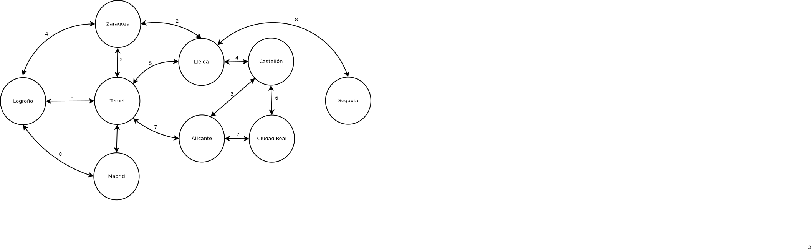
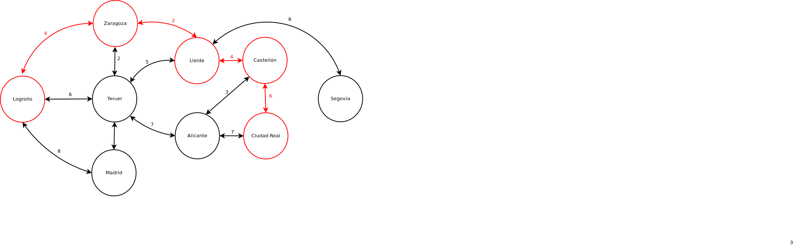

# Dijkstra's Algorithm for shortest path without composer or any external library

Implementation of [Dijkstra's algorithm](https://en.wikipedia.org/wiki/Dijkstra%27s_algorithm) in order to find the
shortest path between two nodes of a graph.

## Direct paths

| Origin    | Destination |  Cost |
| --------- | ----------- | ----: |
| Logroño	| Zaragoza    |     4 |
| Logroño	| Teruel      |     6 |
| Logroño	| Madrid      |     8 |
| Zaragoza  | Teruel      |     2 |
| Zaragoza  | Lleida      |     2 |
| Teruel    | Madrid      |     3 |
| Teruel    | Lleida      |     5 |
| Teruel    | Alicante    |     7 |
| Lleida    | Castellón   |     4 |
| Lleida    | Segovia     |     8 |
| Alicante  | Castellón   |     3 |
| Alicante  | Ciudad Real |     7 |
| Castellón | Ciudad Real |     6 |
| Segovia   | Ciudad Real |     4 |

## Graph



|                 | Logroño | Zaragoza | Teruel | Madrid | Lleida | Alicante | Castellón | Segovia | Ciudad Real |
| --------------- | ------: | -------: | -----: | -----: | -----: | -------: | --------: | ------: | ----------: |
| **Logroño**     |       0 |        4 |      6 |      8 |      0 |        0 |         0 |       0 |           0 |
| **Zaragoza**    |       4 |        0 |      2 |      0 |      2 |        0 |         0 |       0 |           0 |
| **Teruel**      |       6 |        2 |      0 |      3 |      5 |        7 |         0 |       0 |           0 |
| **Madrid**      |       8 |        0 |      3 |      0 |      0 |        0 |         0 |       0 |           0 |
| **Lleida**      |       0 |        2 |      5 |      0 |      0 |        0 |         4 |       8 |           0 |
| **Alicante**    |       0 |        0 |      7 |      0 |      0 |        0 |         3 |       0 |           7 |
| **Castellón**   |       0 |        0 |      0 |      0 |      4 |        3 |         0 |       0 |           6 |
| **Segovia**     |       0 |        0 |      0 |      0 |      8 |        0 |         0 |       0 |           4 |
| **Ciudad Real** |       0 |        0 |      0 |      0 |      0 |        7 |         6 |       4 |           0 |

### Representation in PHP

```php
$cities=['Logroño','Zaragoza','Teruel','Madrid','Lleida','Alicante','Castellón','Segovia','Ciudad Real'];
$connections=[
    [0,4,6,8,0,0,0,0,0],
    [4,0,2,0,2,0,0,0,0],
    [6,2,0,3,5,7,0,0,0],
    [8,0,3,0,0,0,0,0,0],
    [0,2,5,0,0,0,4,8,0],
    [0,0,7,0,0,0,3,0,7],
    [0,0,0,0,4,3,0,0,6],
    [0,0,0,0,8,0,0,0,4],
    [0,0,0,0,0,7,6,4,0],
];
```

## Requirements

- Only pure PHP without any external tool or library

### Shortest path between two nodes

Find the path between two nodes (`Logroño` and `Ciudad Real`):

| Cost | Path                                                      |
| ---: | :-------------------------------------------------------- |
| 16   | Logroño => Zaragoza => Lleida => Castellón => Ciudad Real |



### Shortest path from a node to other all

Find all the shortest paths from a specific node (example: `Madrid`):

| Destination | Cost | Path                                              |
| :---------- | ---: | :------------------------------------------------ |
| Logroño     |  8 | Madrid => Logroño                                   |
| Teruel      |  3 | Madrid => Teruel                                    |
| Zaragoza    |  5 | Madrid => Teruel => Zaragoza                        |
| Lleida      |  7 | Madrid => Teruel => Zaragoza => Lleida              |
| Alicante    | 10 | Madrid => Teruel => Alicante                        |
| Castellón   | 11 | Madrid => Teruel => Zaragoza => Lleida => Castellón |
| Segovia     | 15 | Madrid => Teruel => Zaragoza => Lleida => Segovia   |
| Ciudad Real | 17 | Madrid => Teruel => Alicante => Ciudad Real         |

